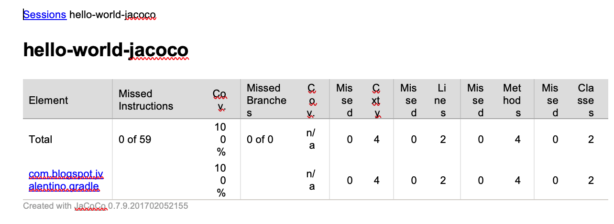
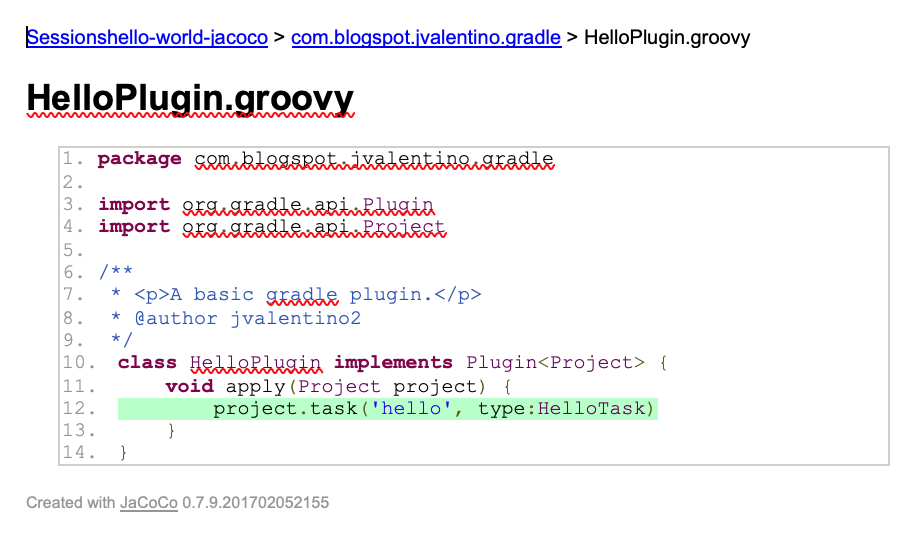
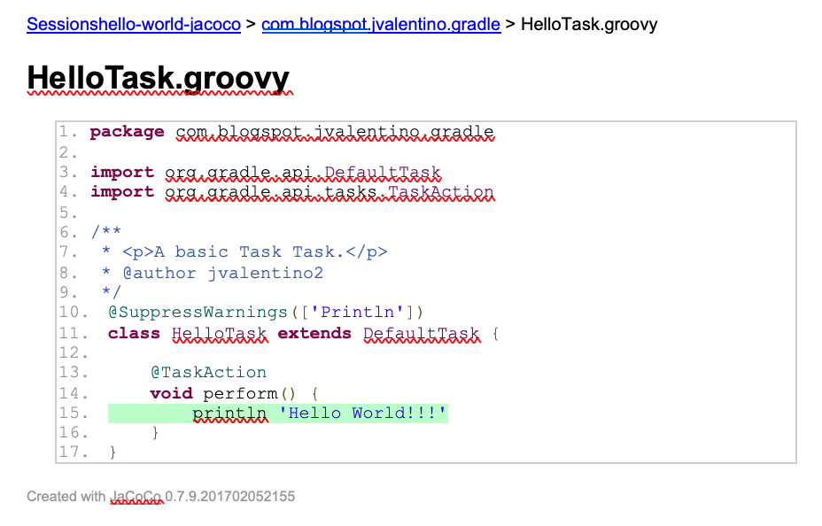

## 3.5 Hello World: Jacoco

This project is the same as the **Hello World: The Plugin** example, except that it additionally includes JaCoCo integration. JaCoCo is a free code coverage library for Java, which has been created by the EclEmma team based on the lessons learned from using and integration existing libraries for many years (http://www.eclemma.org/jacoco/). Code coverage is a measure used to describe the degree to which the source code of a program is executed when a particular test suite runs (https://en.wikipedia.org/wiki/Code_coverage). Gradle includes a plugin for JaCoCo as a part of its standard distribution, so JaCoCo can be quickly implemented in any Gradle build.

#### build.gradle

```groovy
// PLUGINS
apply plugin: 'groovy'
apply plugin: 'jacoco'

// JACOCO
jacocoTestReport {
	reports {
		xml.enabled true
		csv.enabled false
		html.enabled true
	}
}

// GROOVY
version = '1.0.0'
group = 'com.blogspot.jvalentino.gradle'
archivesBaseName = 'hello-world-jacoco'

repositories {
    jcenter()
	mavenCentral()
}

dependencies {
    compile gradleApi()
    compile 'org.codehaus.groovy:groovy-all:2.4.12'

    testCompile 'org.spockframework:spock-core:1.1-groovy-2.4'
}
```

**Line 3: jacoco**

The application of the JaCoCo plugin, which adds the **jacocoTestReport** and **jacocoTestConverageVerification** tasks to the build.

 

**Lines 6-12: Jacoco Settings**

By default, you will only get an HTML report. While this is helpful for the developer when running locally, Continuous Integration solutions such as Jenkins are going to need the XML file for integration.

 

#### Generating the Report

```bash
hello-world-jacoco$ gradlew clean test jacocoTestReport

> Task :test 

BUILD SUCCESSFUL in 19s
6 actionable tasks: 6 executed
```

The **clean** task will delete an existing testing assets and report, the **test** task executes and unit tests, and the **jacocoTestReport** task generates the report for the tests. The result of running these tasks are the XML and HTML reports under **build/reports/jacoco/test**.

#### build/reports/jacoco/test/html/index.html



The index.html page displays package level summaries of all of the code coverage metrics.

 

#### …/HelloPlugin.groovy.html



If you continue to click through the reports, you can drilldown into the HelloPlugin.groovy report. This will use color coding to show when lines are covered; green means good, red means bad (not covered), and yellow will be explained in greater detail later. This report shows that the one line in this class is covered.

 

#### …/HelloTask.groovy.html



This report shows that the one line from the Task class is covered.

 

#### build/reports/test/jacocoTestReport.xml

```xml
<sourcefile name="HelloPlugin.groovy">
	<line nr="12" mi="0" ci="19" mb="0" cb="0" />
	<counter type="INSTRUCTION" missed="0" covered="35" />
	<counter type="LINE" missed="0" covered="1" />
	<counter type="COMPLEXITY" missed="0" covered="2" />
	<counter type="METHOD" missed="0" covered="2" />
	<counter type="CLASS" missed="0" covered="1" />
</sourcefile>
<sourcefile name="HelloTask.groovy">
	<line nr="15" mi="0" ci="8" mb="0" cb="0" />
	<counter type="INSTRUCTION" missed="0" covered="24" />
	<counter type="LINE" missed="0" covered="1" />
	<counter type="COMPLEXITY" missed="0" covered="2" />
	<counter type="METHOD" missed="0" covered="2" />
	<counter type="CLASS" missed="0" covered="1" />
</sourcefile>
```


This report is an XML representation of all code coverage metrics, from parent package to individual classes.

 

#### Instruction Coverage (INSTRUCTION)

The smallest unit JaCoCo counts are single Java byte code instructions. Instruction coverage provides information about the amount of code that has been executed or missed. This metric is completely independent from source formatting and always available, even in absence of debug information in the class files (https://www.eclemma.org/jacoco/trunk/doc/counters.html).

 

#### Branch Coverage

Branch coverage is a testing method, which aims to ensure that each one of the possible branch from each decision point is executed at least once and thereby ensuring that all reachable code is executed (https://www.tutorialspoint.com/software_testing_dictionary/branch_testing.htm).

 

In JaCoCo (https://www.eclemma.org/jacoco/trunk/doc/counters.html):

·   No coverage: No branches in the line has been executed (red diamond)

·   Partial coverage: Only a part of the branches in the line have been executed (yellow diamond)

·   Full coverage: All branches in the line have been executed (green diamond)

 

#### Cyclomatic Complexity (COMPLEXITY)

Cyclomatic complexity is a software metric, used to indicate the complexity of a program. It is a quantitative measure of the number of linearly independent paths through a box program's source code (https://en.wikipedia.org/wiki/Cyclomatic_complexity).

 

#### Line Coverage (LINE)

Line coverage reports on the execution footprint of testing in terms of which lines of code were executed to complete the test (https://en.wikipedia.org/wiki/Code_coverage).

 

#### Method Coverage (METHOD)

A method is considered as executed when at least one instruction has been executed (https://www.eclemma.org/jacoco/trunk/doc/counters.html).

 

#### Class Coverage (CLASS)

A class is considered as executed when at least one of its methods has been executed (https://www.eclemma.org/jacoco/trunk/doc/counters.html).

